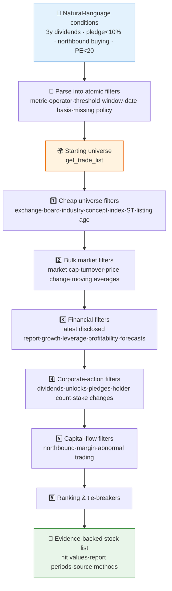

# 🔎 Stock Screener Skill

[简体中文](README.md) | **English**

> "3 straight years of dividends, pledge ratio below 10%, northbound buying, PE under 20" — translates natural-language A-share screening conditions into verified Pandadata API query plans, runs the filter funnel layer by layer, and returns a stock list where every condition is backed by actual values.

**Creator / Maintainer**: [`abgyjaguo`](https://github.com/abgyjaguo)

<p align="center">
  
  
  
  
  
</p>

---

## 📖 What is this

`stock-screener` is an **Agent Skill**: it turns natural-language A-share screening requirements into a **reproducible query plan**, executes the filters layer by layer, and returns an evidence-backed stock list.

Three design pillars:

1. **Atomic filters**: every user condition is parsed into a normalized filter (metric, operator, threshold, window, date basis, missing-data policy, …); ambiguity is restated before execution — e.g. does "3 straight years of dividends" mean three fiscal years with cash dividends, or three calendar years with ex-dividend events?
2. **No look-ahead bias**: financial statements, dividends, forecasts, pledge data, and shareholder events only use rows whose **disclosure or announcement date is not later than the screening date** — point-in-time historical screens are supported;
3. **Auditable results**: the final list shows actual hit values for every condition rather than pass/fail flags; the funnel records each layer's input/output counts, method, parameters, and data dates; names that survive due to missing data are marked `数据缺失` and kept out of strict-pass counts.

> All data contracts come from the sibling skill [`pandadata-api`](https://github.com/quantskills/skill-pandadata-api): its method index or search helper is consulted before every call. Conditions that cannot map to documented data are reported honestly, with the nearest auditable proxy offered.

---

## ⚡ Screening Funnel



Execution order is sorted by **selectivity and API cost**: cheap bulk universe filters first, then market and financial filters; sparse per-symbol calls (pledges, unlocks, shareholder changes, top holders) run only on the surviving universe.

---

## 🗂️ Condition → Method Map

| Screening need | Primary methods |
|---|---|
| Initial stock pool and trading status | `get_trade_list` · `get_stock_status_change` · `get_stock_detail` |
| Market and technical filters | `get_stock_daily` · `get_stock_daily_pre` |
| Valuation and financial statements | `get_fina_reports` · `get_fina_performance` · `get_fina_forecast` |
| Dividends and dividend-yield proxies | `get_stock_cash_dividend` · `get_stock_dividend_amount` |
| Holder count, pledges, holder changes | `get_holder_count` · `get_stock_pledge_stat` · `get_stock_shareholder_change` · `get_top_holders` |
| Northbound, margin, abnormal trading | `get_hsgt_hold` · `get_margin` · `get_lhb_list` |
| Unlock and event-risk exclusions | `get_restricted_list` |
| Industry, concept, index membership | `get_industry_constituents` · `get_concept_constituents` · `get_index_weights` |

The full 13-intent condition map — including ambiguity handling, e.g. whether "northbound buying" is measured by shares, market value, or holding ratio — lives in [`references/screener-guide.md`](references/screener-guide.md).

---

## 🧩 Atomic Filter Contract

Each condition is represented before execution as:

| Field | Meaning |
|---|---|
| `id` | Stable short name, e.g. `cash_dividend_3y` |
| `source_text` | Original user phrase |
| `universe_effect` | Whether it narrows the universe before data fetch |
| `metric` / `operator` / `threshold` | Business metric, operator (`>`, `between`, `rank_top_n`, `rank_percentile`, …), threshold |
| `window` | Lookback period, e.g. `3 fiscal years`, `60 trading days`, `latest report` |
| `date_basis` | Trading date / report period / announcement date / disclosure date |
| `methods` | Pandadata methods to verify through `pandadata-api` |
| `pass_rule` | Plain-language pass/fail rule |
| `missing_policy` | On missing data: exclude / keep with warning / ask user |

---

## 🚀 Quick Start

### 1️⃣ Install (together with pandadata-api)

```bash
# Claude Code (global)
cp -r skill-pandadata-api  ~/.claude/skills/pandadata-api
cp -r skill-stock-screener ~/.claude/skills/stock-screener

# Codex (global, Agent Skills standard directory recommended)
mkdir -p ~/.agents/skills
cp -r skill-pandadata-api  ~/.agents/skills/pandadata-api
cp -r skill-stock-screener ~/.agents/skills/stock-screener

# Cursor (project level)
mkdir -p .cursor/skills
cp -r skill-pandadata-api  .cursor/skills/pandadata-api
cp -r skill-stock-screener .cursor/skills/stock-screener
```

### 2️⃣ Ask in natural language

```text
找出连续3年现金分红、质押率低于10%、PE低于20的股票
筛选沪深300成分里近60天北向加仓、股东户数下降的公司
剔除ST和上市不满3年的，选市值大于500亿且两融余额上升的
```

### 3️⃣ Report structure (fixed 6 sections)

```
Criteria interpretation (normalized filters · screen date · universe · open assumptions)
→ Screening funnel (per-layer in/out counts · method · parameters · data dates)
→ Result list (code · name · hit values · report period/data date · method · notes)
→ Missing & excluded → Rerun info (JSON path · method/parameter summary) → Disclaimer
```

When a rerun matters, results are saved as `screens/<YYYY-MM-DD>-<slug>.json` containing `screen_date / universe / criteria / funnel / results / missing_data / api_calls`.

---

## 📦 Directory Layout

```
stock-screener/
├── SKILL.md                       # Skill entry: core rules, workflow, method map, output standards
├── references/
│   └── screener-guide.md          # 📒 Atomic filter schema, 13-intent condition map, execution order, output contract, QA checklist
└── agents/
    ├── openai.yaml                # OpenAI/Codex adapter
    ├── cursor-rule.mdc            # Cursor project-rule adapter
    └── portable-loader.md         # Generic loader for agents without native skill discovery
```

### Cross-Agent Use

| Runtime | How |
|---|---|
| Claude Code / Codex | Load this folder directly (`$stock-screener`) |
| Cursor | Use `agents/cursor-rule.mdc` as project rule; keep the folder under `.cursor/skills/stock-screener` |
| Hermes / OpenClaw | Use `agents/portable-loader.md` when native `SKILL.md` discovery is unavailable |

---

## 📐 Core Constraints

| Constraint | Description |
|---|---|
| 🧾 Contract first | Every call is verified against `pandadata-api` for parameters, fields, date conventions, return shape |
| 🚫 No invented conditions | No fabricated methods, fields, or factor definitions; unmappable conditions reported honestly with the nearest auditable proxy |
| 📅 Screen date is first-class | Defaults to the latest available trading day; point-in-time historical screens require explicit confirmation |
| ⏮️ No look-ahead bias | Financial/event data restricted to rows disclosed on or before the screen date |
| 🔍 Fully reproducible | Original criteria, normalized filters, methods, parameters, data cutoffs, per-layer row counts, and missing-data notes all preserved |
| 🏅 Hard filters vs ranking | Ranking metrics applied after hard filters, with sort direction, tie-breakers, and top-N/percentile/threshold basis stated |

---

## ⚠️ Disclaimer

Screening results are generated from public data and rule-based conditions, for research reference only. Nothing here constitutes investment advice.

---

## 📄 License

This project is released under the GNU General Public License v3.0 only (`GPL-3.0-only`). See [`LICENSE`](LICENSE) for the full text.

## 🐼 PandaAI / QUANTSKILLS Community

<div align="center">
  
  <br>
  <sub>Scan the QR code to join the PandaAI community for QUANTSKILLS skills, agent workflows, and quantitative research practice.</sub>
</div>
