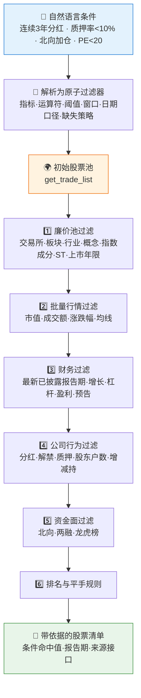

# 🔎 Stock Screener Skill

**简体中文** | [English](README.en.md)

> "连续3年分红、质押率低于10%、北向加仓、PE低于20" —— 把这类自然语言选股条件翻译成经过验证的 Pandadata 接口组合查询，逐层执行筛选漏斗，返回每个条件都有真实数值佐证的股票清单。

**Creator / Maintainer**: [`abgyjaguo`](https://github.com/abgyjaguo)

<p align="center">
  
  
  
  
  
</p>

---

## 📖 这是什么

`stock-screener` 是一个 **Agent Skill**：把自然语言的 A 股筛选需求转成**可复现的查询计划**，逐层执行过滤，输出带依据的股票清单。

三个设计要点：

1. **条件原子化**：每个用户条件先解析为标准化过滤器（指标、运算符、阈值、时间窗、日期口径、缺失数据策略……），歧义先复述确认 —— 比如"连续3年分红"到底指 3 个会计年度有现金分红，还是 3 个自然年有除权除息事件；
2. **杜绝未来函数**：财报、分红、预告、质押、股东事件一律只用**披露/公告日期不晚于筛选日**的行，支持历史时点选股；
3. **结果可审计**：最终清单展示每个条件的真实命中值而不是 pass/fail 标志，筛选漏斗记录每层的进出数量、接口、参数与数据日期；因数据缺失而留下的股票标记 `数据缺失`，不混入严格通过计数。

> 数据契约一律来自姊妹技能 [`pandadata-api`](https://github.com/quantskills/skill-pandadata-api)：调用前先查 `references/method-index.md` 或跑 `scripts/search_api_docs.py` 确认参数与字段。无法映射到有据可查数据的条件会如实说明，并提供最接近的可审计替代口径。

---

## ⚡ 筛选漏斗



执行顺序按**筛除率与 API 成本**排：先跑批量便宜的池过滤，再跑行情和财务，质押/解禁/增减持/十大股东这类按股稀疏查询的接口只对幸存池执行。

---

## 🗂️ 条件 → 接口映射

| 筛选需求 | 主要接口 |
|---|---|
| 初始股票池与交易状态 | `get_trade_list` · `get_stock_status_change` · `get_stock_detail` |
| 行情与技术面过滤 | `get_stock_daily` · `get_stock_daily_pre` |
| 估值与财务报表 | `get_fina_reports` · `get_fina_performance` · `get_fina_forecast` |
| 分红与股息率代理 | `get_stock_cash_dividend` · `get_stock_dividend_amount` |
| 股东户数·质押·股东变动 | `get_holder_count` · `get_stock_pledge_stat` · `get_stock_shareholder_change` · `get_top_holders` |
| 北向·两融·异动 | `get_hsgt_hold` · `get_margin` · `get_lhb_list` |
| 解禁与事件风险排除 | `get_restricted_list` |
| 行业·概念·指数成分 | `get_industry_constituents` · `get_concept_constituents` · `get_index_weights` |

完整的 13 类条件解释指引（含口径歧义处理，如"加仓"按股数/市值/持股比例哪种算）见 [`references/screener-guide.md`](references/screener-guide.md)。

---

## 🧩 原子过滤器契约

每个条件在执行前被表示为：

| 字段 | 含义 |
|---|---|
| `id` | 稳定短名，如 `cash_dividend_3y` |
| `source_text` | 用户原话 |
| `universe_effect` | 是否在取数前先收缩股票池 |
| `metric` / `operator` / `threshold` | 业务指标、运算符（`>` `between` `rank_top_n` `rank_percentile` 等）、阈值 |
| `window` | 回看窗口，如 `3 个会计年度`、`60 个交易日`、`最新报告期` |
| `date_basis` | 交易日 / 报告期 / 公告日 / 披露日 |
| `methods` | 待经 `pandadata-api` 验证的接口名 |
| `pass_rule` | 白话通过规则 |
| `missing_policy` | 缺数据时：剔除 / 保留并警示 / 询问用户 |

---

## 🚀 快速开始

### 1️⃣ 安装（与 pandadata-api 一起）

```bash
# Claude Code（全局）
cp -r skill-pandadata-api  ~/.claude/skills/pandadata-api
cp -r skill-stock-screener ~/.claude/skills/stock-screener

# Codex（全局，推荐 Agent Skills 标准目录）
mkdir -p ~/.agents/skills
cp -r skill-pandadata-api  ~/.agents/skills/pandadata-api
cp -r skill-stock-screener ~/.agents/skills/stock-screener

# Cursor（项目级）
mkdir -p .cursor/skills
cp -r skill-pandadata-api  .cursor/skills/pandadata-api
cp -r skill-stock-screener .cursor/skills/stock-screener
```

### 2️⃣ 直接用自然语言提问

```text
找出连续3年现金分红、质押率低于10%、PE低于20的股票
筛选沪深300成分里近60天北向加仓、股东户数下降的公司
剔除ST和上市不满3年的，选市值大于500亿且两融余额上升的
```

### 3️⃣ 报告结构（固定 6 节）

```
筛选口径（标准化条件·筛选日·股票池·未决假设） → 筛选漏斗（每层进出数量·接口·参数·数据日期）
→ 结果清单（代码·名称·条件命中值·报告期/数据日·方法·备注） → 缺失与剔除
→ 复跑信息（JSON路径·方法参数摘要） → 声明
```

需要复跑时结果会存为 `screens/<YYYY-MM-DD>-<slug>.json`，含 `screen_date / universe / criteria / funnel / results / missing_data / api_calls` 全量字段。

---

## 📦 目录结构

```
stock-screener/
├── SKILL.md                       # 技能入口：核心规则、工作流、接口映射、输出标准
├── references/
│   └── screener-guide.md          # 📒 原子过滤器schema、13类条件地图、执行顺序、输出契约、QA清单
└── agents/
    ├── openai.yaml                # OpenAI/Codex 适配
    ├── cursor-rule.mdc            # Cursor 项目规则适配
    └── portable-loader.md         # 无原生 skill 发现能力的 Agent 通用加载器
```

### 跨 Agent 使用

| 运行时 | 方式 |
|---|---|
| Claude Code / Codex | 直接加载本文件夹（`$stock-screener`） |
| Cursor | `agents/cursor-rule.mdc` 作项目规则，完整文件夹放 `.cursor/skills/stock-screener` |
| Hermes / OpenClaw | 无原生 `SKILL.md` 发现能力时用 `agents/portable-loader.md` |

---

## 📐 核心约束

| 约束 | 说明 |
|---|---|
| 🧾 先查契约 | 每次调用前经 `pandadata-api` 确认参数、字段、日期约定与返回结构 |
| 🚫 不发明条件 | 不虚构接口、字段、因子定义；映射不了的条件如实说明并给最近的可审计替代 |
| 📅 筛选日是一等输入 | 默认最新交易日；历史时点选股需用户确认 |
| ⏮️ 无未来函数 | 财务/事件数据只用披露日 ≤ 筛选日的行 |
| 🔍 全程可复现 | 保留原始条件、标准化过滤器、方法、参数、数据截止日、每层行数与缺失说明 |
| 🏅 硬过滤与排名分离 | 排名指标在硬过滤后单独执行，写明排序方向、平手规则、top N/分位/阈值口径 |

---

## ⚠️ 免责声明

本筛选结果基于公开数据与规则化条件生成，仅供研究参考，不构成任何投资建议。

---

## 📄 许可证

本项目采用 GNU General Public License v3.0 only（`GPL-3.0-only`）发布，完整文本见 [`LICENSE`](LICENSE)。
